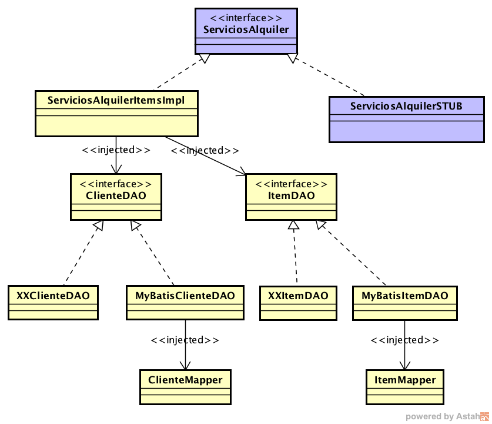

### Escuela Colombiana de Ingeniería
### Procesos de Desarrollo de Software - PDSW

#### Integración de Capas con Google Guice


# Parte I. (Inicio en clase, terminado para el Jueves)

1. Actualice el presente proyecto con los Mappers realizados en el ejercicio anterior.

3. Usando como referencia la implementación de ItemDAO: MyBATISItemDao, cree el DAO MyBATIS de Cliente.

4. Declare en la implementación de la capa lógica (ServiciosAlquilerItemsImpl), que a ServiciosItemsImpl se le inyectará un ItemDAO y un ClienteDAO:

    @Inject
    private ItemDAO daoItem;

    @Inject
    private ClienteDAO daoCliente;

5. Modifique la clase ServiciosAlquilerFactory para que además de hacer 'bind' de la interfaz ServiciosAlquier con la implementación ServiciosAlquilerItemsImpl, haga 'bind' de:
	* ItemDAO con MyBATISItemDAO
	* ClienteDAO con MyBATISClienteDAO

6. Pruebe el programa 'Main' suministrado, y con este rectifique que a través de la capa lógica se pueda consultar un cliente.

7. Implemente el método load de la clase MyBATISDAOCliente, y el método 'consultarCliente' (haciendo uso del DAOCLiente inyectado). Haga un programa para comprobar que la consulta de un cliente se haga correctamente, a través de la capa lógica.


# Parte II - Laboratorio

1. Agregue los elementos desarrollados en el punto I (dependencias, mappers, DAOs, etc) en el proyecto que sólo tiene la capa de presentación.
2. Ajuste los casos de prueba, para que ahora haga uso de la capa lógica que hace uso de la base de datos volátil:

	```java
	ServiciosAlquiler sa=ServiciosAlquilerFactory.getInstance().getServiciosAlquilerTesting()
	```

3. Implemente las operaciones de la lógica que hagan falta para satisfacer los requerido por la capa de presentación, teniendo en cuenta, lo cual eventualmente requerirá agregar más operaciones a los DAOs -y por ende- más mappers de MyBATIS.
4. Tenga en cuenta, a las operaciones que impliquen registrar o actualizar registros, demarcar la transaccionalidad con la anotación @Transactional.
